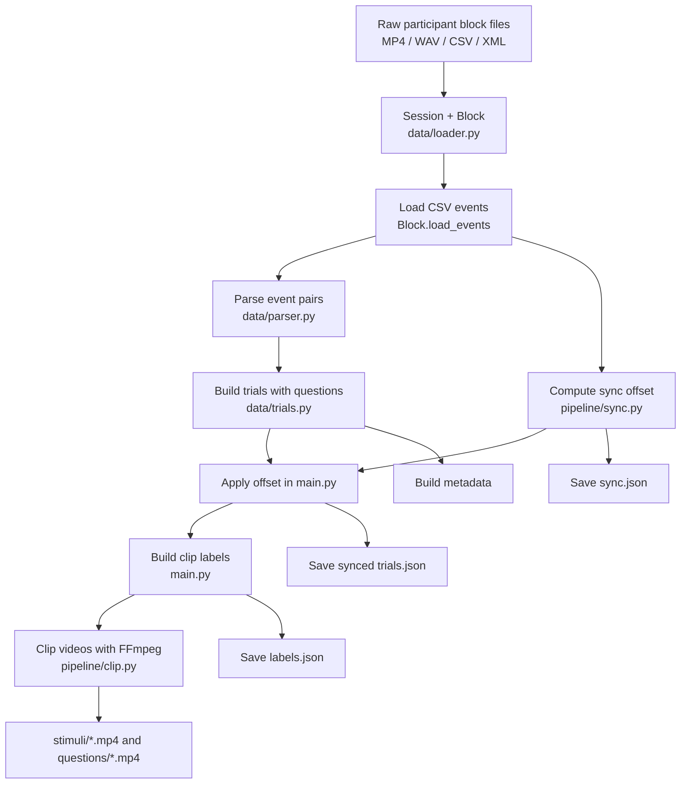
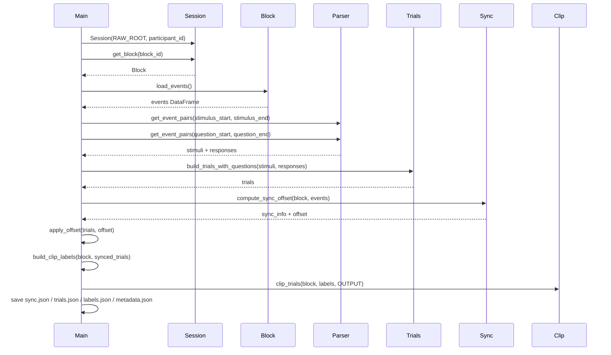
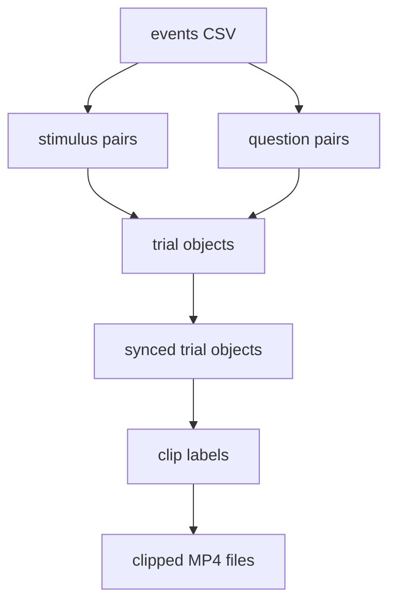

# `src` Pipeline Overview

This document describes the current pipeline implemented in `src/`, what each module does, how data moves through the system, what gets written to disk, and what assumptions the code currently makes.

The intent is to make the pipeline easy to visualize, explain, and extend.

## Purpose

The `src` pipeline takes one participant block and turns raw experiment files into:

- synced trial timings in video time
- clip labels for stimulus and question clips
- clipped MP4 files for each trial segment
- metadata and sync diagnostics

In short:

1. load raw block files
2. parse event timestamps from CSV
3. build trial objects
4. detect the sync tone in audio/video
5. shift trial timestamps into video time
6. build labels for clipping
7. clip videos with FFmpeg
8. validate the output structure

## Main Entry Point

The current script entry is [`main.py`](./main.py).

At the moment it is a single-block runner with hardcoded values:

```python
participant_id = "AAAD"
block_id = "B00"
```

To run the pipeline:

```bash
cd src
../venv/bin/python main.py
```

## Pipeline At A Glance



## Execution Order In `main.py`



## Module Map

| Module | Role | Key functions |
|---|---|---|
| `data/loader.py` | Resolves participant/block files and loads CSV events | `Session.get_block`, `Block.load_events` |
| `data/parser.py` | Converts event streams into matched start/end pairs | `get_event_pairs` |
| `data/trials.py` | Builds semantic trial objects from stimuli and questions | `build_trials_with_questions`, `build_metadata` |
| `pipeline/sync.py` | Finds the real sync tone in audio and computes video offset | `compute_sync_offset` |
| `pipeline/clip.py` | Cuts MP4 clips based on labels | `clip_trials`, `clip_video` |
| `main.py` | Orchestrates the full pipeline | `run_block`, `apply_offset`, `build_clip_labels` |
| `load_data.py` | Legacy duplicate of older loading/parsing logic | not used by `main.py` |
| `utils/io.py` | Currently empty | none |

## Step-By-Step Breakdown

### 1. File Resolution and Block Loading

Implemented in `data/loader.py`.

Responsibilities:

- locate the participant base directory
- support both nested layouts like `raw/AAAD/B00/...`
- support flat layouts like `raw/AAAE/AAAE_B00.*`
- resolve filenames case-insensitively

Input expectation per block:

- `PARTICIPANT_BLOCK.mp4`
- `PARTICIPANT_BLOCK.wav` if already extracted
- `PARTICIPANT_BLOCK.csv`
- `PARTICIPANT_BLOCK.xml`

The CSV is loaded into a pandas DataFrame with the normalized columns:

- `t`
- `event`
- `detail`

## 2. Event Pair Parsing

Implemented in `data/parser.py`.

The pipeline extracts two event streams:

- stimuli: `stimulus_start` -> `stimulus_end`
- responses: `question_start` -> `question_end`

Each pair becomes:

```json
{
  "start": 24.093,
  "end": 54.130,
  "detail": "B00_01"
}
```

Important assumption:

- start and end events must have equal counts
- pairing is positional, not identity-matched by `detail`

That means the CSV must already be internally ordered and consistent.

## 3. Trial Construction

Implemented in `data/trials.py`.

Each stimulus becomes a trial. Matching question events are attached to that trial based on the `detail` naming convention:

```text
B01_01_surprise_Q03
```

This is split into:

- `trial_id = B01_01_surprise`
- `question_id = Q03`

Each final trial object looks like:

```json
{
  "trial_id": "B01_01_surprise",
  "stimulus_start": 16.590,
  "stimulus_end": 49.689,
  "is_neutral": false,
  "emotion": "surprise",
  "questions": [
    {
      "question_id": "Q01",
      "start": 54.713,
      "end": 58.804,
      "index": 0,
      "question_number": 1
    }
  ]
}
```

## 4. Trial Validation

Implemented in `main.py`.

Before and after sync, the pipeline validates:

- each stimulus start is before stimulus end
- each question start is before question end
- the first question starts after the stimulus ends
- the first stimulus-to-question gap must be between `2.5` and `6.0` seconds

This is useful because the pipeline assumes the question period begins after a short fall-off window.

## 5. Sync Detection

Implemented in `pipeline/sync.py`.

This is the part that converts experiment time into video time.

### Current sync strategy

The code no longer trusts the CSV `beep_start` as the location of the physical audio cue in the recording.

Instead it:

1. chooses `wav` if available, otherwise falls back to the video file
2. extracts the first `45` seconds of audio using FFmpeg
3. downsamples to mono `8 kHz`
4. computes a spectrogram
5. searches for a sustained, narrowband `1 kHz` tone
6. returns the tone onset as `video_beep_time`
7. computes:

```text
offset = video_beep_time - csv_beep_time
```

### Why this works

The expected sync signal is a strong tone near:

- `980-1020 Hz`
- about `1.0` second long

The detector measures:

- target-band energy near 1 kHz
- adjacent-band energy around it
- a smoothed score across the expected tone duration

It then returns:

- `video_beep_time`
- `video_beep_peak_time`
- `video_beep_end_time`
- `dominant_freq`
- `peak_ratio`
- `offset`

### Sync visualization


## 6. Applying the Sync Offset

Implemented in `main.py`.

`apply_offset()` shifts every stimulus and question timestamp:

- `stimulus_start += offset`
- `stimulus_end += offset`
- `question.start += offset`
- `question.end += offset`

After this step, the trial timestamps are in video time.

Important:

- `trials.json` currently stores the synced, video-time version
- it does not preserve the original raw CSV timestamps

## 7. Clip Label Generation

Implemented in `main.py` as `build_clip_labels()`.

This converts synced trials into a flat list of clip jobs.

Two clip types are created:

- `stimulus`
- `response`

### Stimulus clip logic

A stimulus clip does not end exactly at `stimulus_end`.

It extends into the fall-off window until the first question starts:

```text
falloff_end = first_question.start
falloff_sec = falloff_end - stimulus_end
```

If a trial has no questions, the fallback is:

```text
falloff_end = stimulus_end + 5.0
```

This means the stimulus clips deliberately include the post-stimulus gap before the first question.

### Example label

```json
{
  "file": "stimuli/B00_01_stim.mp4",
  "participant": "AAAD",
  "block": "B00",
  "trial_id": "B00_01",
  "type": "stimulus",
  "emotion": "neutral",
  "is_neutral": true,
  "start": 47.314,
  "end": 82.360,
  "falloff_sec": 5.046
}
```

## 8. Clip Validation

Implemented in `main.py`.

Every label is checked for:

- `start < end`
- `stimulus` clips must include `falloff_sec`
- `response` clips must include `question_id`

## 9. Video Clipping

Implemented in `pipeline/clip.py`.

For each label:

1. compute `duration = end - start`
2. create output directory if missing
3. call FFmpeg with stream copy:

```bash
ffmpeg -y -ss START -i INPUT -t DURATION -c:v copy -c:a copy OUTPUT
```

This is fast because it avoids re-encoding.

Outputs are written as:

- `processed/<participant>/<block>/stimuli/*.mp4`
- `processed/<participant>/<block>/questions/*.mp4`

## Output Structure

The pipeline expects this final structure:

```text
processed/
  <participant>/
    <block>/
      sync.json
      trials.json
      metadata.json
      labels.json
      stimuli/
        *.mp4
      questions/
        *.mp4
```

Final validation checks that all of these exist.

## Output Files Explained

### `sync.json`

Contains sync diagnostics:

- CSV beep time
- detected video cue timing
- offset
- frequency and confidence-like values

### `trials.json`

Contains synced trials in video time.

This is the canonical timestamp structure after offset is applied.

### `metadata.json`

Contains summary counts:

- participant
- block
- number of trials
- number of questions
- neutral vs emotional counts
- CSV beep time
- sync offset

### `labels.json`

Contains the flat list of clip instructions used by `clip_trials()`.

## Data Transformations



## Important Assumptions

1. Event pairing is positional.
2. Question `detail` strings follow the `_QNN` naming scheme.
3. The sync tone exists within the first `45` seconds.
4. The sync tone is a strong narrowband signal near `1 kHz`.
5. Stimulus clips should include the fall-off region before the first question.
6. `trials.json` is video-time, not raw CSV time.

## Important Current Caveats

### `src/load_data.py` is legacy

`src/load_data.py` duplicates older loading/parsing/trial code, but `main.py` does not use it.

If you want one clean source of truth, this file should either be removed or clearly marked as legacy.

### `src/utils/io.py` is empty

It currently does not contribute to the pipeline.

### `main.py` is still a script, not a CLI

It currently requires manually editing:

- `participant_id`
- `block_id`

for each run.

### Raw CSV times are not preserved in pipeline output

The current output saves only synced trial times.

If you need both:

- experiment/CSV time
- video time

then the pipeline should save both explicitly.

## Practical "How To Explain It" Summary

If you need a short explanation for someone else:

> The `src` pipeline loads one experimental block, turns CSV events into structured trials, finds the real sync tone in the recording audio, shifts all trial timestamps into video time, generates clip labels for stimulus and response segments, clips those segments from the source MP4, and saves validated outputs (`sync.json`, `trials.json`, `metadata.json`, `labels.json`, and clip folders).

## Recommended Next Improvements

If this pipeline is going to be used more broadly, the next high-value improvements would be:

1. turn `main.py` into a proper CLI with arguments
2. preserve both raw and synced trial timestamps
3. add tests for event pairing, sync detection, and label generation
4. remove or isolate legacy duplicate code in `load_data.py`
5. add a visualization notebook or HTML report for one full block run
